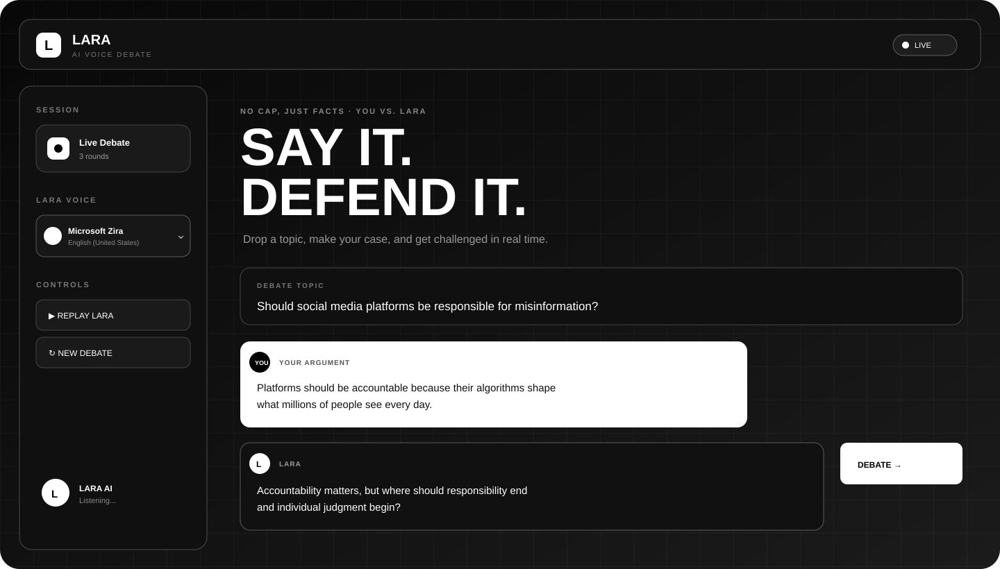
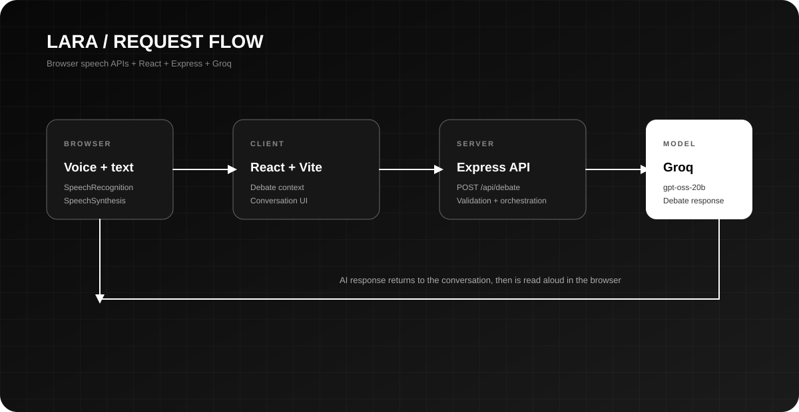

# LARA — AI Voice Debate Bot

<p align="center">
  
</p>

<p align="center"><strong>Say it. Defend it. Think better.</strong></p>

<p align="center">
  
  
  
</p>

LARA is an AI-powered debate partner that challenges your reasoning in real time. Present an argument by voice or text, receive a structured counterargument, and continue the conversation across multiple rounds.

It is designed for practicing critical thinking, communication, public speaking, and the ability to defend an idea under pressure.

## Contents

- [Features](#features)
- [How It Works](#how-it-works)
- [Architecture](#architecture)
- [Technology](#technology)
- [Project Structure](#project-structure)
- [Getting Started](#getting-started)
- [Environment Variables](#environment-variables)
- [Using LARA](#using-lara)
- [API Reference](#api-reference)
- [Browser Support](#browser-support)
- [Troubleshooting](#troubleshooting)
- [Roadmap](#roadmap)

## Features

- Voice argument input through the browser Web Speech API
- Text-based debate input with Enter-to-send support
- AI-generated counterarguments and follow-up questions
- Browser text-to-speech for LARA responses
- Multi-round conversation history
- Selectable browser voice and replay controls
- Live round tracking and response state indicators
- Responsive monochrome interface for desktop and mobile
- Clear separation between the React client and Express API

## How It Works

1. Enter a debate topic.
2. Type an argument or use **Speak** to dictate one.
3. The client sends the topic, current history, and latest argument to the API.
4. The server builds a debate prompt and sends it to Groq.
5. LARA's response is added to the conversation and read aloud in the browser.
6. Continue the debate for as many rounds as you like.

## Architecture

<p align="center">
  
</p>

The request path is:

```text
Browser voice/text input
          |
          v
React client  -- POST /api/debate -->  Express server
          ^                                  |
          |                                  v
Browser speech synthesis  <-- response --  Groq API
```

The browser handles speech recognition and speech synthesis. The server is responsible for validation, prompt construction, and the Groq request. No audio file is uploaded by the application.

## Technology

| Layer | Technology |
| --- | --- |
| Client | React 19, Vite 7, browser Web Speech API |
| Server | Node.js, Express 4, CORS, dotenv |
| AI | Groq SDK with `openai/gpt-oss-20b` |
| Styling | Plain CSS with responsive layouts and animations |
| Data | In-memory client conversation state; JSON data folder reserved for project data |

## Project Structure

```text
AI-VOICE-DEBATE-BOT/
├── client/
│   ├── index.html
│   ├── package.json
│   ├── vite.config.js
│   └── src/
│       ├── App.jsx
│       ├── main.jsx
│       ├── components/       # Debate UI, voice controls, particles, overlays
│       ├── context/          # Shared debate state
│       ├── hooks/            # Voice-related hooks
│       ├── pages/            # Debate, home, and results views
│       ├── services/         # API client
│       └── styles/            # Global application styles
├── server/
│   ├── package.json
│   ├── server.js
│   ├── controllers/          # HTTP request handlers
│   ├── prompts/              # Debate system prompt
│   ├── routes/               # Express routes
│   ├── services/             # Groq and speech service modules
│   └── utils/
├── assets/
│   ├── architecture.svg
│   └── lara-ui.svg
└── README.md
```

## Getting Started

### Prerequisites

- Node.js 18 or newer
- npm 9 or newer
- A Groq API key
- A modern browser with Web Speech API support for voice features

### 1. Clone the repository

```bash
git clone <your-repository-url>
cd AI-VOICE-DEBATE-BOT
```

### 2. Install server dependencies

```bash
cd server
npm install
```

### 3. Configure the server

Create `server/.env`:

```env
GROQ_API_KEY=your_groq_api_key
PORT=5000
```

Never commit `.env` or expose the Groq key in the client.

### 4. Install client dependencies

Open a second terminal from the project root:

```bash
cd client
npm install
```

### 5. Start the application

Start the API server:

```bash
cd server
npm run dev
```

Start the Vite client in a second terminal:

```bash
cd client
npm run dev
```

Open the local URL printed by Vite, usually `http://localhost:5173`.

## Environment Variables

| Variable | Required | Default | Description |
| --- | --- | --- | --- |
| `GROQ_API_KEY` | Yes | None | API key used by the server to call Groq |
| `PORT` | No | `5000` | Port used by the Express server |

The client currently calls `http://localhost:5000/api`. If the server runs on another host or port, update `client/src/services/api.js` accordingly.

## Using LARA

- **Topic:** Enter a focused question or claim rather than a broad subject.
- **Argument:** Make one clear claim and support it with evidence or reasoning.
- **Voice input:** Select **Speak** and allow microphone access when prompted.
- **Replay:** Use **Replay LARA** to hear the latest response again.
- **New debate:** Use **New Debate** to clear the current conversation.
- **Voice selection:** Choose an installed browser speech voice from the LARA voice panel.

A strong starting prompt looks like:

```text
Topic: Should universities require students to use AI tools?
Argument: Universities should teach responsible AI use because avoiding the technology leaves graduates unprepared for modern work.
```

## API Reference

### `GET /`

Returns a basic server health response.

Example response:

```json
{
  "status": "online",
  "application": "LARA AI Voice Debate Bot"
}
```

### `POST /api/debate`

Generates the next LARA debate response.

Request body:

```json
{
  "topic": "Should social media platforms be responsible for misinformation?",
  "history": "user: Platforms should be accountable...\nai: Accountability matters, but...",
  "userArgument": "Their recommendation systems amplify content at enormous scale."
}
```

Success response:

```json
{
  "success": true,
  "response": "A debate response generated by the configured Groq model."
}
```

Validation errors return HTTP `400`. Model or server errors return HTTP `500`.

## Browser Support

Voice features depend on browser support for `SpeechRecognition` or `webkitSpeechRecognition`, and `speechSynthesis`.

- Chrome and Edge generally provide the best support.
- Firefox and Safari may support speech synthesis while offering limited or no speech recognition support.
- Text debate remains available when voice recognition is unavailable.
- Microphone permissions must be granted for voice input.

## Troubleshooting

### The client cannot reach the server

Confirm the API is running on port `5000` and that `client/src/services/api.js` points to the same URL.

### `GROQ_API_KEY is missing`

Create `server/.env`, add a valid key, and restart the server process.

### No voices appear in the voice picker

Browser voices load asynchronously. Wait briefly after opening the page, then refresh. Confirm that speech synthesis is supported by the browser.

### Voice input is unavailable

Use Chrome or Edge, check microphone permissions, and run the client from a local development server rather than opening the HTML file directly.

### Building the client

The current client `build` script maps to Vite's default command. For an explicit production build, run:

```bash
cd client
npx vite build
```

## Roadmap

- Persist debates with user accounts or local storage
- Add debate modes such as Socratic, cross-examination, and timed rounds
- Add results and argument-quality scoring
- Add configurable language and voice settings
- Add automated API and component tests
- Add a production deployment configuration

## License

No license file is currently included. Add the repository's chosen license text before distributing the project publicly.

---

<p align="center"><strong>LARA</strong><br />Challenge the idea. Sharpen the thinker.</p>
