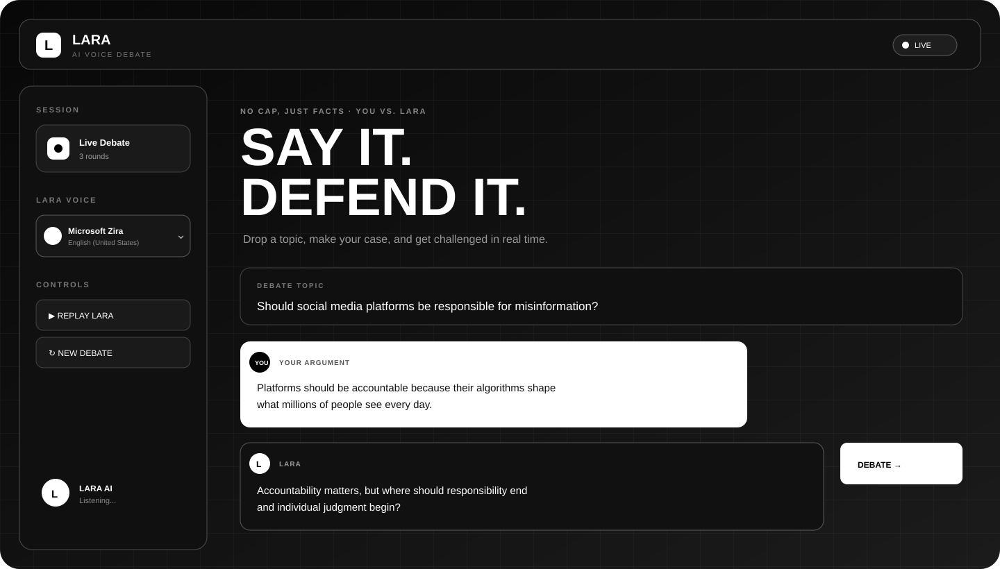
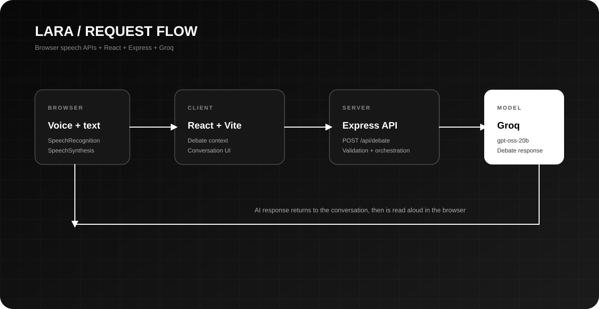

# LARA — AI Voice Debate Bot

<p align="center">
  
</p>

<p align="center"><strong>Say it. Defend it. Think better.</strong></p>

<p align="center">
  
  
  
</p>

LARA is an AI-powered debate partner that challenges your reasoning in real time. Present an argument by voice or text, receive a structured counterargument, and continue the conversation across multiple rounds.

It is designed for practicing critical thinking, communication, public speaking, and the ability to defend an idea under pressure.

## Contents

- [Features](#features)
- [How It Works](#how-it-works)
- [Architecture](#architecture)
- [Technology](#technology)
- [Project Structure](#project-structure)
- [Getting Started](#getting-started)
- [Environment Variables](#environment-variables)
- [Using LARA](#using-lara)
- [API Reference](#api-reference)
- [Browser Support](#browser-support)
- [Troubleshooting](#troubleshooting)
- [Roadmap](#roadmap)

## Features

- Live video debate: LARA appears as a gender-neutral AI figure rendered in real time, or as a streamed, lip-synced D-ID avatar when configured, while Groq stays the debate brain
- Idle, listening, thinking and speaking states driven by real events from the speech recognizer, Groq and the avatar stream
- Required debate setup: field (or a custom field), difficulty level and any topic you choose
- Difficulty levels that change how LARA argues: Beginner, Intermediate and Advanced
- Voice argument input through the browser Web Speech API, with live transcript and mic level
- Text-based debate input with Enter-to-send support
- AI-generated counterarguments with highlighted key phrases and a challenge question every round
- Browser text-to-speech for LARA, with pause, resume, replay and mute
- Multi-round debate progress (Topic → You → LARA → Challenge → Next)
- History, a personal leaderboard and a profile, stored locally in the browser
- Warm, dark, responsive interface for desktop, tablet and mobile

## How It Works

1. Select a field, choose a level and enter a debate topic, then press **Start Debate**.
2. Type an argument or use the mic to dictate one.
3. The client sends the topic, field, level, recent history and latest argument to the API.
4. The server builds a debate prompt and sends it to Groq.
5. LARA's response is added to the conversation and read aloud in the browser.
6. Continue the debate for as many rounds as you like.

## Architecture

<p align="center">
  
</p>

The request path is:

```text
Browser voice/text input
          |
          v
React client  -- POST /api/debate -->  Express server
          ^                                  |
          |                                  v
Browser speech synthesis  <-- response --  Groq API
```

The browser handles speech recognition and speech synthesis. The server is responsible for validation, prompt construction, and the Groq request. No audio file is uploaded by the application.

## Technology

| Layer | Technology |
| --- | --- |
| Client | React 19, Vite 7, browser Web Speech API |
| Server | Node.js, Express 4, CORS, dotenv |
| AI | Groq SDK with `openai/gpt-oss-20b` |
| Avatar | D-ID Agents SDK (`@d-id/client-sdk`), WebRTC / LiveKit streaming |
| Styling | Plain CSS with responsive layouts and animations |
| Data | Live session state in React context; finished debates, profile and voice preferences in `localStorage` |

## Project Structure

```text
AI-VOICE-DEBATE-BOT/
├── client/
│   ├── index.html
│   ├── package.json
│   ├── vite.config.js
│   └── src/
│       ├── App.jsx
│       ├── main.jsx
│       ├── avatar/           # Live avatar session hook and provider adapters
│       ├── components/       # Live video panel, setup, progress, conversation, voice controls
│       ├── config/           # Debate fields/levels and LARA's avatar config
│       ├── context/          # Debate session state and flow
│       ├── hooks/            # Speech recognition, speech synthesis, audio levels
│       ├── pages/            # Debate, History, Leaderboard, Profile
│       ├── services/         # API client and local storage
│       ├── utils/            # Response parsing, formatting, stats
│       └── styles/           # Global application styles
├── server/
│   ├── package.json
│   ├── server.js
│   ├── controllers/          # HTTP request handlers (debate, avatar session)
│   ├── prompts/              # Debate system prompt
│   ├── routes/               # Express routes
│   ├── services/             # Groq debate engine and avatar providers
│   └── utils/
├── assets/
│   ├── architecture.svg
│   └── lara-ui.svg
└── README.md
```

## Getting Started

### Prerequisites

- Node.js 18 or newer
- npm 9 or newer
- A Groq API key
- A modern browser with Web Speech API support for voice features

### 1. Clone the repository

```bash
git clone <your-repository-url>
cd AI-VOICE-DEBATE-BOT
```

### 2. Install server dependencies

```bash
cd server
npm install
```

### 3. Configure the server

Create `server/.env`:

```env
GROQ_API_KEY=your_groq_api_key
PORT=5000
```

Never commit `.env` or expose the Groq key in the client.

### 4. Install client dependencies

Open a second terminal from the project root:

```bash
cd client
npm install
```

### 5. Start the application

Start the API server:

```bash
cd server
npm run dev
```

Start the Vite client in a second terminal:

```bash
cd client
npm run dev
```

Open the local URL printed by Vite, usually `http://localhost:5173`.

## Environment Variables

| Variable | Required | Default | Description |
| --- | --- | --- | --- |
| `GROQ_API_KEY` | Yes | None | API key used by the server to call Groq |
| `PORT` | No | `5000` | Port used by the Express server |
| `AVATAR_PROVIDER` | No | None | `did` to enable LARA's live talking avatar |
| `DID_API_KEY` | With `did` | None | D-ID API key, used only on the server |
| `DID_AGENT_ID` | With `did` | None | The D-ID Agent that renders LARA |
| `DID_ALLOWED_DOMAINS` | No | `http://localhost:5173,http://localhost:5174,http://localhost` | Origins allowed to use the browser client key |

The client calls `http://localhost:5000/api` by default. If the server runs elsewhere, set `VITE_API_URL` in `client/.env` (for example `VITE_API_URL=http://localhost:5050/api`).

## Using LARA

- **Field and level:** Both are required. Pick **Custom** to name your own field.
- **Topic:** Enter a focused question or claim rather than a broad subject.
- **Argument:** Make one clear claim and support it with evidence or reasoning.
- **Voice input:** Click the mic and allow microphone access when prompted.
- **Playback:** Pause, resume or replay LARA from the waveform bar, or replay any earlier response from the conversation.
- **Mute / Camera Off:** Silence LARA's voice or hide her video during a debate.
- **End Debate:** Saves the debate to **History** and the **Leaderboard**. **New Debate** also clears the topic.
- **Voice selection:** Choose an installed browser speech voice on the **Profile** page.

A strong starting prompt looks like:

```text
Topic: Should universities require students to use AI tools?
Argument: Universities should teach responsible AI use because avoiding the technology leaves graduates unprepared for modern work.
```

## API Reference

### `GET /`

Returns a basic server health response.

Example response:

```json
{
  "status": "online",
  "application": "LARA AI Voice Debate Bot"
}
```

### `POST /api/debate`

Generates the next LARA debate response.

Request body:

```json
{
  "topic": "Should social media platforms be responsible for misinformation?",
  "field": "Technology",
  "level": "intermediate",
  "history": "user: Platforms should be accountable...\nai: Accountability matters, but...",
  "userArgument": "Their recommendation systems amplify content at enormous scale."
}
```

Success response:

```json
{
  "success": true,
  "response": "A debate response generated by the configured Groq model."
}
```

`field` and `level` (`beginner`, `intermediate` or `advanced`) are optional for backward compatibility; when provided they shape the depth and length of LARA's reply. Validation errors return HTTP `400`. Model or server errors return HTTP `500`.

### `GET /api/avatar/status`

Whether live video is configured, without any credentials: `{ "available": true, "provider": "did", "profile": { "name", "thumbnail" } }`, or `{ "available": false, "message": "..." }`.

### `POST /api/avatar/session`

Starts a browser session: `{ "available": true, "provider": "did", "agentId", "clientKey", "expiresAt", "profile" }`. The client key is short-lived and restricted to `DID_ALLOWED_DOMAINS`. Returns `503` when live video is not configured and `502` when the provider rejects the request.

## Live Talking Avatar

Groq remains the only source of debate logic; LARA's avatar only renders and voices what Groq wrote.

### Built-in figure (default)

Out of the box LARA is a gender-neutral AI figure drawn on a canvas every frame (`client/src/avatar/figure/createLaraFigure.js`). Her head moves, she blinks and looks around, and she reacts to each state: leaning in and lighting up while you speak, glancing away with a violet tint while she thinks. While she speaks with the browser voice, each word the speech engine reports opens her mouth in time with the audio. Voices that report no word timing still animate in a speaking rhythm.

### Streaming avatar (optional, D-ID)

With D-ID configured, LARA becomes a streamed talking avatar over WebRTC, with lip sync done by D-ID.

```text
React ──POST /api/debate──▶ Express ──▶ Groq (openai/gpt-oss-20b) ──▶ counterargument + challenge
React ──POST /api/avatar/session──▶ Express ──(secret API key)──▶ D-ID: short-lived client key
React ──D-ID Agents SDK (client key)──▶ WebRTC stream ──▶ <video>
React ──speak(counterargument), speak(challenge)──▶ LARA says Groq's exact words, lip-synced
```

### Setup (D-ID)

1. Create an Agent in [D-ID Studio](https://studio.d-id.com/) with the presenter and voice you want for LARA. Turn off any greeting so she only says what Groq writes. A Clips (V3) Pro or Expressive (V4) avatar gives a fluent stream that can be interrupted mid-answer.
2. Add the credentials to `server/.env`:

   ```env
   AVATAR_PROVIDER=did
   DID_API_KEY=your_d_id_api_key
   DID_AGENT_ID=agt_xxxxxxxx
   DID_ALLOWED_DOMAINS=http://localhost:5173,http://localhost:5174,http://localhost
   ```

3. Restart the server. The secret key never leaves the server: the browser receives a one-hour client key that works only for this agent and only from `DID_ALLOWED_DOMAINS`.

Use a presenter you have the rights to animate, such as a D-ID stock presenter or an image of someone who has consented.

### How it behaves

- LARA joins the call when you press **Start Debate** and leaves on **End Debate**, so you are only billed for the debate itself. Closing the tab also ends the session.
- **LARA is thinking...** shows while Groq works and until the avatar actually starts talking. **LARA is speaking...** follows the avatar's own talking events. The counterargument and the challenge are spoken as two clips, so the Challenge step lights when she really reaches the question.
- Starting the mic, sending a new argument, or pressing Stop interrupts her. Fluent streams stop at the source; on legacy streams the rest of the clip is silenced.
- If the session times out between rounds, it reconnects while Groq prepares the next reply. If D-ID is not configured or the stream fails, LARA continues as her built-in figure with browser speech, and a failed stream can be retried from the video panel.

### Swapping providers

The provider is a replaceable layer on both sides:

- Server: add a provider next to `server/services/avatar/didProvider.js` (with `isConfigured`, `getStatus`, `createSession`) and register it in `server/services/avatar/index.js`.
- Client: add an adapter next to `client/src/avatar/providers/did.js` that exposes `connect`, `reconnect`, `speak`, `interrupt` and `disconnect`, reports `onMedia`, `onConnection`, `onSpeaking` and `onError`, and register it in `client/src/avatar/providers/index.js`.

Nothing else in the debate flow changes.

## Browser Support

Voice features depend on browser support for `SpeechRecognition` or `webkitSpeechRecognition`, and `speechSynthesis`.

- Chrome and Edge generally provide the best support.
- Firefox and Safari may support speech synthesis while offering limited or no speech recognition support.
- Text debate remains available when voice recognition is unavailable.
- Microphone permissions must be granted for voice input.

## Troubleshooting

### The client cannot reach the server

Confirm the API is running on port `5000` and that `client/src/services/api.js` points to the same URL.

### `GROQ_API_KEY is missing`

Create `server/.env`, add a valid key, and restart the server process.

### No voices appear in the voice picker

Browser voices load asynchronously. Wait briefly after opening the page, then refresh. Confirm that speech synthesis is supported by the browser.

### Voice input is unavailable

Use Chrome or Edge, check microphone permissions, and run the client from a local development server rather than opening the HTML file directly.

### Building the client

```bash
cd client
npm run build
```

## Roadmap

- Sync debate history across devices with user accounts
- Add debate modes such as Socratic, cross-examination, and timed rounds
- Add results and argument-quality scoring
- Add configurable language and voice settings
- Add automated API and component tests
- Add a production deployment configuration

## License

No license file is currently included. Add the repository's chosen license text before distributing the project publicly.

---

<p align="center"><strong>LARA</strong><br />Challenge the idea. Sharpen the thinker.</p>
